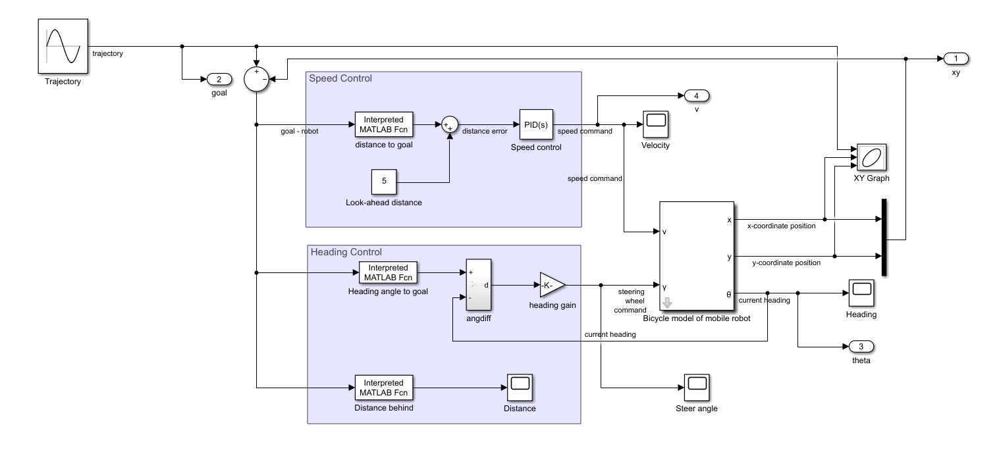

#### Project motivation

This project focuses on the trajectory tracking and kinematic control of a differential drive mobile robot using the bicycle model. Differential drive robots, known for their simplicity and maneuverability, are commonly used in various autonomous applications, and accurate trajectory tracking is critical for their performance in navigation tasks. The main objective of this project is to implement a trajectory tracking system that uses the bicycle model to simulate and control the movement of a differential drive mobile robot. The system aims to minimize the error between the robot’s current position and the desired path using feedback mechanisms for both velocity and steering control.

### More details are in the report