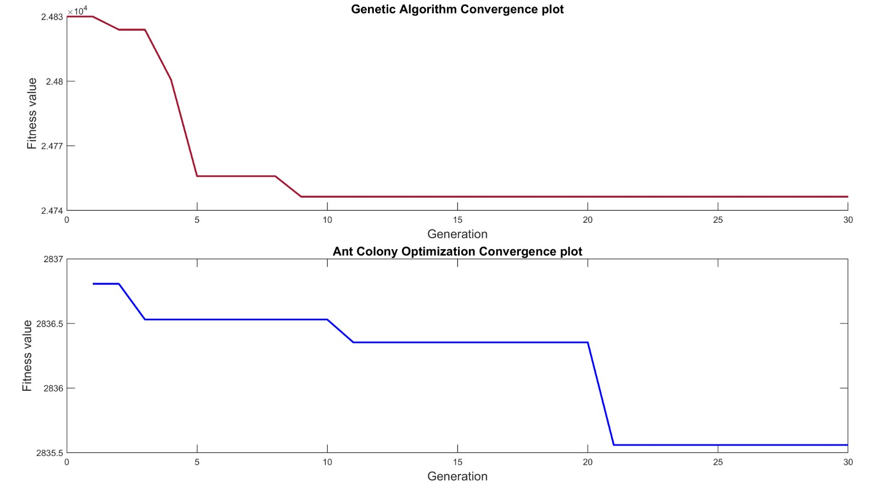

### Abstract
This research presents a comprehensive approach to the design and implementation of a Proportional Integral Derivative (PID) controller for a 5-degree-of-freedom (DOF) robotic manipulator, utilizing meta-heuristic optimization algorithms. The robotic arm, initially designed using SolidWorks, was translated into a Simscape model for simulation purposes. Two distinct optimization algorithms, the Genetic Algorithm (GA) and Ant Colony Optimization

(ACO), were employed to fine-tune the PID controller gains, aiming to enhance the system’s dynamic performance and stability. The optimized PID gains obtained from simulations were then applied to a physical prototype of the robotic manipulator, which was 3D printed based on the SolidWorks design. The coding and real-time implementation of the PID controllers were conducted using MATLAB.

### Problem statement
The optimization of the PID controller using Genetic Algorithms and Ant Colony Optimization aims to address the laborious nature of manual PID tuning method.

These evolutionary and swarm intelligence-based algorithms offer the potential to efficiently explore the vast parameter space, leading to improved controller performance, robustness, and adaptability. The primary challenge lies in achieving optimal

PID controller parameters for the 5 DOF robotic arm to ensure precise, responsive, and stable control. While current studies often utilize individual nature-inspired optimization algorithms for tuning PID controllers, there is a gap in the literature regarding a comprehensive comparison of the trade-offs and effectiveness of these algorithms specifically applied to a 5-DOF robotic manipulator. This study aims to fill this gap by providing a detailed comparative analysis, ultimately contributing to the development of more efficient and robust control strategies for robotic systems.

### Cost of implementation of both algorithms to PID control

Upon comparison, it was observed that the Genetic Algorithm (GA) exhibited faster convergence and ran more efficiently than the Ant Colony Optimization (ACO) algorithm.

### More details of the project and results (graphs) are documented in the report